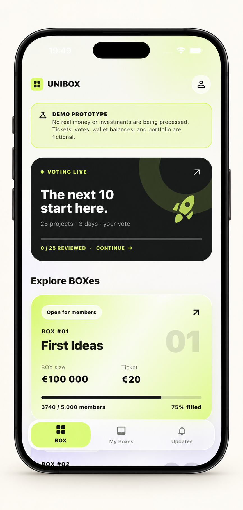
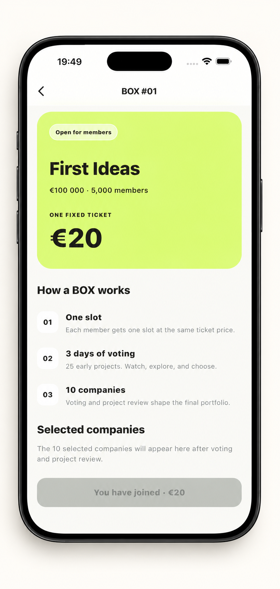
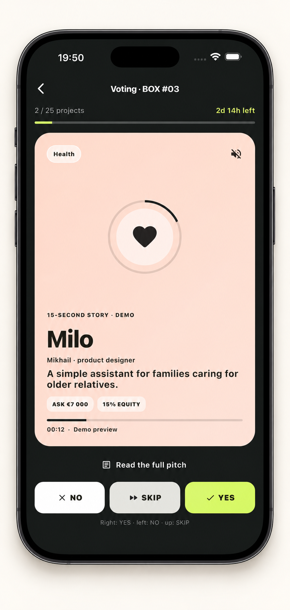
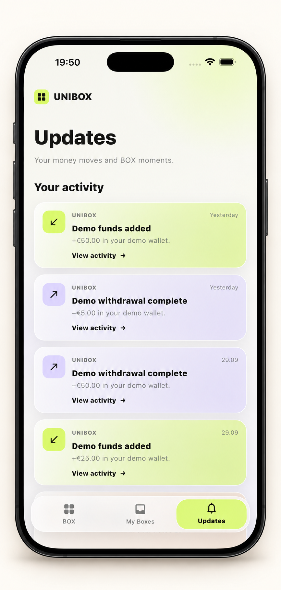
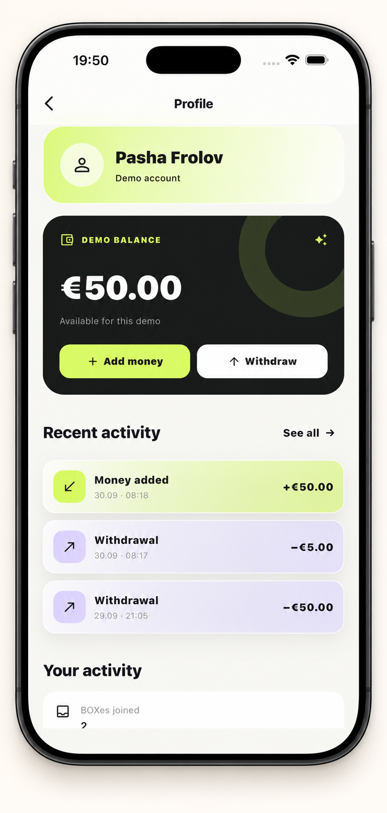

# UNIBOX

**A community powered concept for diversified micro pre-seed investing in early stage startups.**

UNIBOX explores a way for people to back a curated group of young companies through small, fixed tickets. This repository is a product portfolio for incubators, accelerators, and potential partners. It contains no application source code.

> **Product demo only.** Nothing in this repository is an investment offer, solicitation, or invitation to transfer funds. The MVP accepts no real client funds and executes no real investments.

## The problem

AI tools, cloud infrastructure, and open-source software let a single founder build and test more than ever before. Yet many promising projects face a **micro pre-seed gap**: a €2,000–€10,000 cheque can be meaningful to a founder while being too small for a conventional venture capital process.

## The solution: Boxes

A **Box** is a proposed, themed funding round with a small, fixed investment ticket. Participants would gain exposure to a selected group of startups rather than making a single-company bet.

| Illustrative Box | Calculation | Total |
| --- | ---: | ---: |
| 5,000 tickets at €10 each | 5,000 × €10 | €50,000 |

This is an example of the product concept, **not** an active offering, funding target, or return projection.

## How it works

The envisioned journey is:

Box funding → 20–30 pre-screened startups → ~30-second founder pitches → 3-day community voting → ~10 selected companies → diversified portfolio → potential long-term exits

Selection, investment execution, ownership structure, and any future exits would depend on the final legal and regulatory design. The figures above describe the proposed experience, not completed transactions.

## Market validation for founders

Alongside funding, the concept gives founders structured feedback on interest in their idea:

| Signal | What it could show |
| --- | --- |
| Pitch views | Reach of the short pitch |
| Detailed pitch opens | Depth of initial interest |
| Support rate | Share of participating viewers who support the startup |
| Problem resonance | How strongly the stated problem connects with the audience |

These are planned product signals. No traction, conversion, or investment performance metrics are claimed here.

## MVP

A **working Flutter MVP** demonstrates the product flow with demo Boxes, simulated investment tickets, and voting. It is a demonstration environment: **no real client funds are accepted and no real investments are executed at the MVP stage**.

The application source is intentionally outside this public portfolio.

## Product walkthrough

These mockups follow the demo journey from discovering a Box to reviewing activity. **Every amount, balance, member count, vote, startup, and transaction shown is fictional demo data.** The €20 / €100,000 Box on these screens is a separate demo configuration from the €10 / €50,000 illustration above. No live funding or investment activity is depicted.

| 1. Explore Boxes | 2. Review a Box |
| --- | --- |
|  |  |
| Discover the concept and available demo Boxes. | See the fixed ticket and proposed selection process. |

| 3. Review founder pitches | 4. Follow demo updates |
| --- | --- |
|  |  |
| Explore a short pitch and simulated voting controls. | Review fictional wallet and activity notifications. |

| 5. View the demo profile |
| --- |
|  |
| See the fictional balance and activity history. The personal email was removed from this public mockup. |

## Regulatory approach

Any live investment service would be developed only after the required regulatory and legal work. The intended approach is to work with an **authorised European partner** for future KYC/AML, handling of client money, and regulated investment execution. The precise structure, partner, permissions, and jurisdictions have not yet been finalised.

*UNIBOX is an early-stage product concept. This public repository is a portfolio and demo description, not an investment offer or financial advice.*
